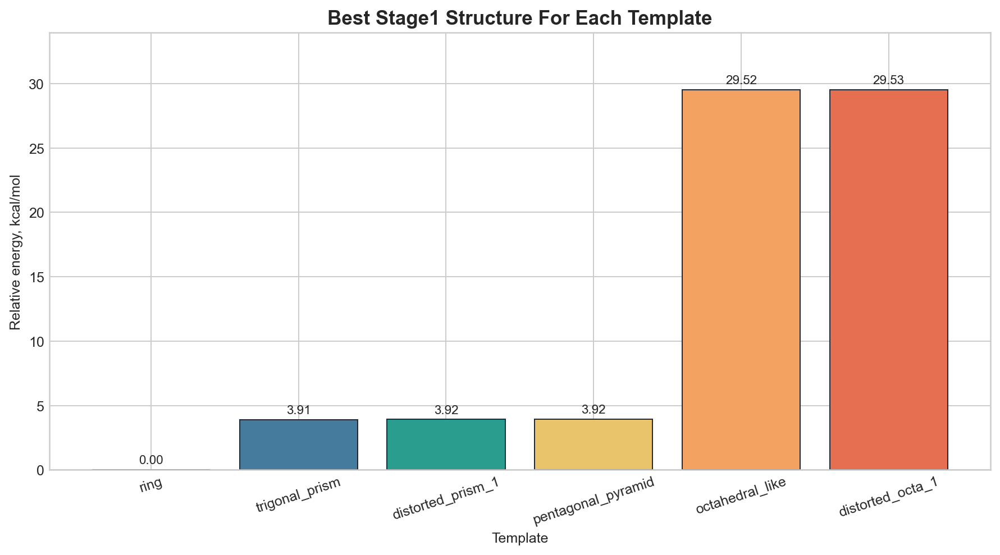
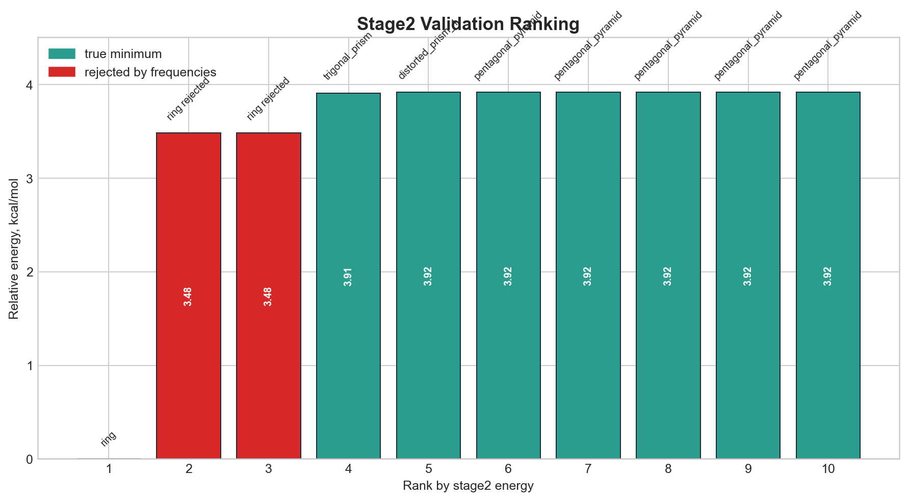

# Results Report

Отчет ниже содержит только итоговые результаты расчетов без описания workflow и организационной части.

## 1. Краткий итог

- Всего расчетов `stage1`: `108`
- Успешно завершено на `stage1`: `107`
- Проверено кандидатов на `stage2`: `10`
- Подтверждено минимумов после частотной проверки: `8`
- Отклонено из-за мнимых частот: `2`

## 2. Лучший результат всей кампании

- Лучшая подтвержденная структура: `ring`
- Расстояние: `1.9 A`
- Мультиплетность: `3`
- Энергия `stage2`: `-148.743338857395 Eh`
- Минимальная частота: `0.00 cm^-1`

## 3. Графики

### 3.1 Лучший результат по каждому стартовому шаблону (`stage1`)

### 3.2 Ранжирование кандидатов `stage2` с учетом частотной проверки

## 4. Лучшие структуры по мультиплетностям (`stage1`)

| Multiplicity | Template | Distance, A | Energy, Eh | Delta to global best, kcal/mol |
| --- | --- | --- | --- | --- |
| `3` | `ring` | `1.9` | `-148.743338856923` | `0.0000` |
| `1` | `trigonal_prism` | `1.45` | `-148.737106377803` | `3.9109` |
| `5` | `pentagonal_pyramid` | `2.05` | `-148.669785790046` | `46.1552` |

## 5. Подтвержденные минимумы после `stage2`

| Rank | Template | Distance, A | M | Energy, Eh | Delta to best, kcal/mol |
| --- | --- | --- | --- | --- | --- |
| 1 | `ring` | `1.9` | `3` | `-148.743338857395` | `0.0000` |
| 2 | `trigonal_prism` | `1.45` | `1` | `-148.737106377705` | `3.9109` |
| 3 | `distorted_prism_1` | `1.45` | `1` | `-148.737094291299` | `3.9185` |
| 4 | `pentagonal_pyramid` | `1.75` | `1` | `-148.737091825588` | `3.9201` |
| 5 | `pentagonal_pyramid` | `1.45` | `1` | `-148.737091824857` | `3.9201` |
| 6 | `pentagonal_pyramid` | `1.9` | `1` | `-148.737091824339` | `3.9201` |
| 7 | `pentagonal_pyramid` | `1.6` | `1` | `-148.737091824060` | `3.9201` |
| 8 | `pentagonal_pyramid` | `2.05` | `1` | `-148.737091823436` | `3.9201` |

## 6. Лучшие подтвержденные шаблоны (`stage2`)

| Template | Best energy, Eh | Delta to best, kcal/mol |
| --- | --- | --- |
| `ring` | `-148.743338857395` | `0.0000` |
| `trigonal_prism` | `-148.737106377705` | `3.9109` |
| `distorted_prism_1` | `-148.737094291299` | `3.9185` |
| `pentagonal_pyramid` | `-148.737091825588` | `3.9201` |

## 7. Что было отброшено на частотной проверке

- `ring`: `2`

## 8. Краткий вывод по результатам

В текущем обследованном наборе конфигураций глобальный минимум соответствует триплетной структуре `ring` при `1.90 A`.
Частотная проверка показала, что два энергетически сильных `ring`-кандидата на больших расстояниях (`2.05 A` и `2.20 A`) не являются истинными минимумами.
После отбраковки по частотам в финале остаются `trigonal_prism`, `distorted_prism_1` и кластер `pentagonal_pyramid`, но все они лежат примерно на `3.91-3.92 kcal/mol` выше глобального минимума.
